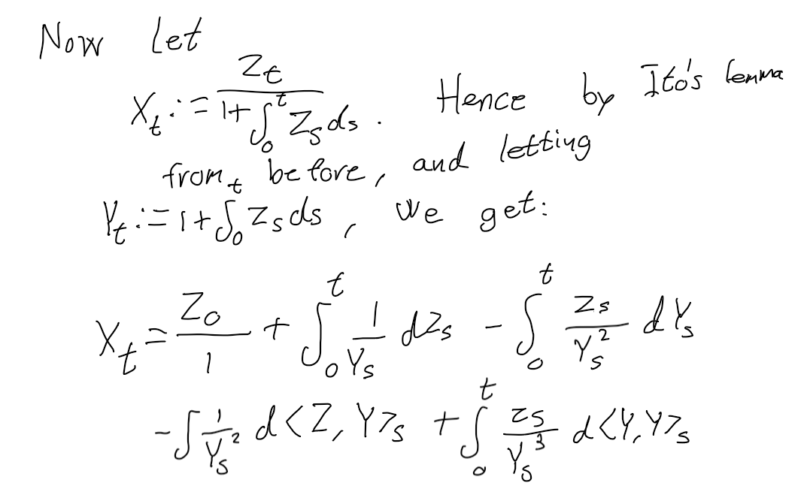

```{r setup, include=FALSE}
knitr::opts_chunk$set(echo = TRUE)
library(magrittr)
library(tidyverse)
library(sde)
```


## Exercise 1.





### Strong solution argument:

It is a strong solution, since $X$ is determined with respect to the same Brownian motion $B$ as the one defining the SDE, and thus $X$ is adapted to the natural filtration of $B$.


## Exercise 2.

Parameters:

$$  \lambda = x = \bar{\sigma} = T = 1. $$

### 1, 2

By Using a Riemann approximation of $ \int_0^t Z_s ds$, write a code that simulates (with error) the exact solution of $(1)$ (i.e. (2)) on an equally spaced grid of $[0,1]$ given by

$$t_k = \frac{k}{n}, \quad k = 0, \ldots, n, \quad n \in \mathbb{N}.$$


Plot simulated paths for $n = 10000$.


```{r}

set.seed(1)


sim_BM <- function(T_, delta) {
  tmesh <- seq(from = 0, to = T_, by = delta)
  N <- length(tmesh)
  step <- delta * T_
  Norm <- rnorm(N)
  B <- c(0, cumsum(sqrt(step) * Norm[-N]))
  output <- data.frame(B = B, Norm = Norm)
  return(output)
}

Z_t <- function(t, B) {
  exp(0.5 * t + B)
}

b <- function(t, X_t) {
  X_t - X_t^2
}

sigma <- function(t, X_t) {
  X_t
}

sigma_dif <- function(t, X_t) {
  1
}

approx_integral_exact_solution_Euler_sol_Milstein_sol <- function(delta, T_ = 1, b, sigma, x_0 = 0, Z_t, sigma_dif) {
  N_n <- ceiling(T_ / delta)
  tmesh <- seq(from = 0, to = T_, by = delta)
  sim_BM_result <- sim_BM(T_, delta)
  B <- sim_BM_result$B
  X <- c(0)
  X_2 <- c(x_0)
  X_3 <- c(x_0)
  step <- delta * T_
  for (k in 2:(N_n + 1)) {
    # Approximate integral
    X[k] <- X[k - 1] + Z_t(tmesh[k], B[k - 1]) * step
    # Euler scheme
    X_2[k] <- X_2[k - 1] + b(tmesh[k], X_2[k - 1]) * step +
      sigma(tmesh[k], X_2[k - 1]) * (B[k] - B[k - 1])
    # Milstein scheme
    X_3[k] <- X_3[k - 1] + b(tmesh[k], X_3[k - 1]) * step + sigma(tmesh[k], X_3[k - 1]) * (B[k] - B[k - 1]) +
      1 / 2 * sigma(tmesh[k - 1], X_3[k - 1]) * sigma_dif(tmesh[k - 1], X_3[k - 1]) * ((B[k] - B[k - 1])^2 - step)
  }

  XX <- Z_t(t = tmesh, B = B) / (1 + X)
  output <- data.frame(
    exact = XX,
    euler = X_2,
    milstein = X_3
  )
  return(output)
}

plot_sde <- function(n) {
  XX <- approx_integral_exact_solution_Euler_sol_Milstein_sol(
    delta = 1 / n,
    T_ = 1,
    b = b,
    sigma = sigma,
    x_0 = 1,
    Z_t = Z_t,
    sigma_dif = sigma_dif
  )
  par(mfrow = c(3, 1))
  plot.ts(XX$exact)
  plot.ts(XX$euler)
  plot.ts(XX$milstein)
  par(mfrow = c(1, 1))
}


plot_sde(10)
plot_sde(100)
plot_sde(1000)
plot_sde(10000)


# Exercise 6.
afstand_max <- function(a, b) {
  dist <- abs(a - b)^2
  max(dist)
}


MC_estimate_comparison <- function(n, MC_n) {
  MC <- data.frame()

  for (i in 1:MC_n) {
    output <- approx_integral_exact_solution_Euler_sol_Milstein_sol(
      delta = 1 / n,
      T_ = 1,
      b = b,
      sigma = sigma,
      x_0 = 1,
      Z_t = Z_t,
      sigma_dif = sigma_dif
    )
    MC[i, "Euler"] <- afstand_max(output$exact, output$euler)
    MC[i, "Milstein"] <- afstand_max(output$exact, output$milstein)
  }

  output_data <- data.frame(n = n, Euler_mean_dist = mean(MC$Euler), Milstein_mean_dist = mean(MC$Milstein))
  return(output_data)
}

comp_1 <- MC_estimate_comparison(1, 1000)
comp_1
comp_10 <- MC_estimate_comparison(10, 1000)
comp_10
comp_50 <- MC_estimate_comparison(50, 1000)
comp_50
comp_100 <- MC_estimate_comparison(100, 1000)
comp_100

plot_data_mc_est_compa <- bind_rows(comp_1, comp_10, comp_50, comp_100)

ggplot(data = plot_data_mc_est_compa, aes(x = n)) +
  geom_point(aes(y = Euler_mean_dist), color = "red") +
  geom_point(aes(y = Milstein_mean_dist), color = "blue")
```


## Exercise 3 and 4

<embed src="ex_3_4.pdf" type="application/pdf" height="800" width="900" />


### Last part of exercise 4

```{r}

b_V <- function(t, X_t) {
  0.5 - 0.5 * X_t
}

sigma_V <- function(t, X_t) {
  0.4 * sqrt(X_t)
}

b_S <- function(t, X_t) {
  0
}

sigma_S_1 <- function(t, X_t, V_t) {
  sqrt((1 - (-0.7)^2) * V_t) * X_t
}

sigma_S_2 <- function(t, X_t, V_t) {
  X_t * sqrt(V_t) * (-0.7)
}

Euler_scheme <- function(delta, T_ = 1) {
  N_n <- ceiling(T_ / delta)
  tmesh <- seq(from = 0, to = T_, by = delta)
  sim_BM_result_1 <- sim_BM(T_, delta)
  sim_BM_result_2 <- sim_BM(T_, delta)
  B_1 <- sim_BM_result_1$B
  B_2 <- sim_BM_result_2$B
  X <- c(0.3)
  X_2 <- c(1)
  step <- delta * T_
  for (k in 2:(N_n + 1)) {
    # V
    X[k] <- X[k - 1] + b_V(tmesh[k], X[k - 1]) * step +
      sigma_V(tmesh[k], X[k - 1]) * (B_2[k] - B_2[k - 1])
  }
  
  for (k in 2:(N_n + 1)) {
    X_2[k] <- X_2[k - 1] + b_S(tmesh[k], X_2[k - 1]) * step +
      sigma_S_1(tmesh[k], X_2[k - 1], X[k-1]) * (B_1[k] - B_1[k - 1]) +
      sigma_S_2(tmesh[k], X_2[k-1], X[k-1]) * (B_2[k] - B_2[k-1])
  }
  
  return(X_2)

}

Euler_scheme(delta = 1 / 1000, T_ = 1) %>% plot.ts()
data_mean_Euler_scheme <- c()
for (i in 1:10000) {
  data_mean_Euler_scheme[i] <- max(last(Euler_scheme(delta = 1 / 1000, T_ = 1)) - 1, 0)
}
mean(data_mean_Euler_scheme)

```
