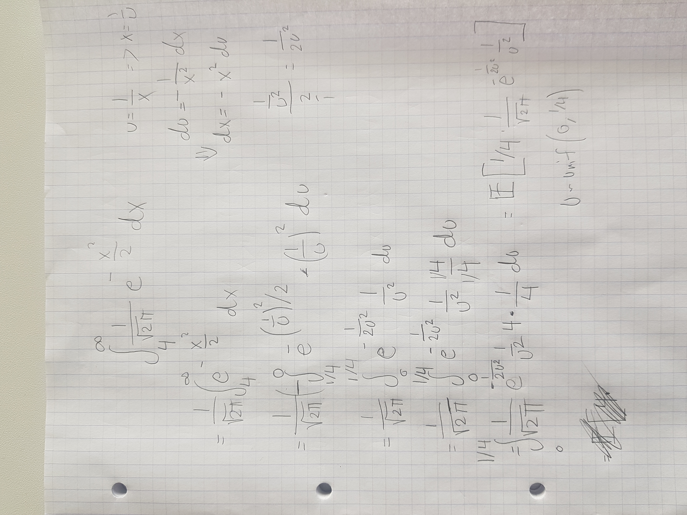

```{r include=FALSE}
Sys.setenv(language="en")
options(scipen = 50)
library(tidyverse)

```

# Introduction

This selfstudy assignment should be answered using a single Rmd file which can
be run on one of the university servers js{01,02,03,04} in a resonable amount of time.
Please add student name in the yaml header (if you are a group of students working
together you are allowed to only hand in one answer with all your names on it).

To embed Rcpp code in your Rmd file use the chunk option `engine='Rcpp'` as below:
```{r engine='Rcpp'}
#include <Rcpp.h>
// [[Rcpp::export]]
int fibonacci(const int x) {
    if (x == 0 || x == 1) return(x);
    return (fibonacci(x - 1)) + fibonacci(x - 2);
}
```

```{r}
fibonacci(4)
```

To complete the exercises you need both to fill in a bit of LaTeX math formulas
and some R and C++ code.

# Monte Carlo integration

## Problem A: Gaussian tail probability

Consider the tail probability $P(X>4)$ where $X\sim N(0,1)$.

- Express the probability as an integral of an indicator function over the real
line and provide a simple Monte Carlo (MC) estimate of the probability along with
the MC standard error based on $100,000$ simulations.


$P(X>4) = E[1_{X>4}] = \int_{\mathbb{R}} f(x) 1_{x>4}  dx$


```{r}
set.seed(123)
dat <- rnorm(100000)

indic_mean <- mean(dat>4);indic_mean # Expectation of indicator
sd(dat) # close to 1


pnorm(4, lower.tail = F)
```


- Make a change of variable $u=1/x$ and express the integral with respect to the
uniform distribution on $(0,1/4)$ and use this to obtain a more accurate MC estimate
(report both MC estimate and MC std. error).




```{r}

unif_data <- runif(10000, min = 0, max = 0.25)

unif_result <- 0.25 * 1/sqrt(2*pi) * exp(-1/(2*unif_data^2)) * 1/unif_data^2

mean(unif_result)

sd(unif_result)/sqrt(length(unif_result))

```


## Problem B: Complicated regions of integration

- Suppose we have a collection of (possibly overlapping) discs with centers in
$[0,1]^2$ and we wish to estimate the fraction of the unit square covered by these.

Give a MC estimate and MC std. error for the fraction covered by the following discs:
```{r}
set.seed(42)
n <- 1000
centers <- data.frame(x=runif(n), y=runif(n))
r <- .03
par(pty = "s")
plot(centers, pch = ".", axes = FALSE, xlab = "", ylab = "")
symbols(centers, circles = rep(r, n), inches = FALSE, bg = gray(.5, .5), add = TRUE)
rect(0,0,1,1, lwd = 3)


```


```{r}
afstand_centers <- function(x) {
  vec <- (x-centers)
  output <- apply(vec, 1, norm,type="2")
  return(output)
}


centers_mc <- data.frame(x=runif(100), y=runif(100))

mc_rslt <- apply(centers_mc, 1, afstand_centers)


mean(apply(mc_rslt, 2, min) < r)

sd(apply(mc_rslt, 2, min)< r)/sqrt(100)


```


- If you implement this with a for loop I suggest trying to do it in C++.

- Consider whether sorting the centers according to e.g. x-coordinate can be used to speed up calculations, and possibly implement this to see if it works.

### Answer:

You could gain speed by not checking the points that are too far away to have the necesarry distance. I.e. if the distance to the x coordinate alone is too much then there is no point calculating the distance.

- Explain how considering a single circle of radius 0.5 centered in (0.5,0.5)
could be used to estimate $\pi=3.14...$ using MC.

### Answer:

Using the same idea as before but with only 1 center and the appropiate r, gives the relation of the area of the circle wrt. the square. Then $\pi$ is isolated in the equation for the area of a circle, i.e $\pi = A/r^2 $.


## Problem C: Combining MC estimates

- Assume we have $k$ MC estimates $m_i = 1/n_i\sum_{j=1}^{n_i} y_i$ with std. errors
$\text{se}_i$ based on sample size $n_i$, $i=1,\dots,k$ which are all independent
estimates of the same mean value. How can you construct a combined estimate and standard error based
on the total sample size $n_{\bullet} = \sum_{j=1}^k n_i$?

### Answer:

We see two different ideas, a simple mean of the means, or a weighted mean of the means, weighted by $n_i$. Same for standard error.


- Use `mclapply()` (or another parallel processing function) to run 10 independent
MC estimates of the integral in problem A and use the
formula derived above to combine these to a single MC estimate and MC std. error.

```{r}
library(parallel)
set.seed(123)

indicator_mean_para <- function(n) {
  data <- rnorm(n)
  return(mean(data>4))
}

vec_para <- rep(10000, 10)
mclapply(vec_para, indicator_mean_para)

# cl <- makeCluster(getOption("cl.cores", 2))
cl <- makeCluster(2)
para_rslt <- parSapply(cl, vec_para, indicator_mean_para)
para_rslt

microbenchmark::microbenchmark(mclapply(vec_para, indicator_mean_para),
                               sapply(vec_para, indicator_mean_para),
                               parSapply(cl, vec_para, indicator_mean_para), times = 5)
stopCluster(cl)
```


# Rcpp

## Problem D: Vector auto-regressive process

Consider a vector auto-regressive process of order 1, VAR(1) in $\mathbb{R}^d$
with $d\times d$ lag parameter matrix $A$:
$$x_t = Ax_{t-1} + e^t$$
where $e_t$ is a process of iid multivariate Gaussian variables $e^t \sim N_d(\mu, \Sigma)$.

Given the starting state $x_0 = 0$ we wish to simulate a realization of $\{x_t\}_{t=1}^n$.

- Verify that the following R function indeed generates an $d \times n$ matrix
containing `n` multivariate Gaussian vectors with mean vector `mu` and covariance
matrix `Sigma` (simply check
that the empirical covariance matrix is close to the given one for a specific 2x2 case of your choice):

```{r}
mvrnormR <- function(mu, Sigma, n) {
  d <- length(mu)
  stopifnot(nrow(Sigma) == d)
  std_norm <- matrix(rnorm(n*d), nrow = d, ncol = n)
  mu + t(chol(Sigma)) %*% std_norm
}
```

```{r}

mvnorm_data <- mvrnormR(c(1,2), matrix(c(1,0,0,4), nrow = 2), 1000)

var(t(mvnorm_data))

```


- Use `RcppArmadillo` to implement this as a new function `mvrnormcpp()` and
benchmark the two functions for the following input (check that they approximately have the same distribution -- you can only use `all.equal()` to check if you have managed to use the same random numbers in both cases):

```{r}
d <- 2
Sigma <- matrix(c(2,1,1,4), nrow = 2, ncol = 2)
n <- 1000
set.seed(42)
mu <- c(10, 20)
```


```{r engine='Rcpp'}
#include <RcppArmadillo.h>
//[[Rcpp::depends(RcppArmadillo)]]

using namespace Rcpp ;
using namespace arma ;


// [[Rcpp::export]]
mat mvrnormRcpp(colvec mu, mat Sigma, int n) {
  int d = mu.size();
  mat std_norm = mat(d,n,fill::randn);
  mat chol_sigma = chol(Sigma);
  mat output_pre_mu = chol_sigma.t() * std_norm;
  mat mu_reppet = mat(d,0);
  for (int i = 0;i<n;i++){
    mu_reppet.insert_cols(i, mu);
  }
  mat output = mu_reppet + output_pre_mu;
  return output;
}


// [[Rcpp::export]]
mat simcpp(mat A, mat Sigma, int n) {
  vec mu = vec(Sigma.n_rows);
  mu.fill(0);
  mat errors = mvrnormRcpp(mu, Sigma, n);
  mat simdata = mat(mu.size(),n,fill::zeros);
  for (int i = 1; i < n; i++){
    simdata.col(i) = A * simdata.col(i-1) + errors.col(i);
  }
  return simdata;
}


```

```{r}

test_1 <- mvrnormR(mu, Sigma, n)
test_2 <- mvrnormRcpp(mu, Sigma, n)

var(t(test_1))
var(t(test_2))

microbenchmark::microbenchmark(mvrnormR(mu, Sigma, n), mvrnormRcpp(mu, Sigma, n))

```

Simulation of VAR(1) is obtained with the R function `simR()` below. Implement
this as a C++ function `simcpp()` which calls `mvrnormcpp()` you made before and
benchmark the C++ and R implementations. We will use
`A <- matrix(c(0.7,0.2,0.2,0.7),2,2)` as the coefficient matrix.

```{r}
simR <- function(A, Sigma, n) {
  mu <- rep(0, nrow(Sigma))
  errors <- mvrnormR(mu, Sigma, n)
  simdata <- matrix(0, length(mu), n)
  for (col in 2:ncol(errors)) {
    simdata[,col] = A %*% simdata[,(col-1)] + errors[,col]
  }
  return(simdata)
}
```

```{r}
set.seed(42)
Sigma <- matrix(c(2,1,1,4), nrow = 2, ncol = 2)
n <- 100
A <- matrix(c(0.7,0.2,0.2,0.7),2,2)

simR(A, Sigma, n)
simcpp(A, Sigma, n)

microbenchmark::microbenchmark(simR(A, Sigma, n), simcpp(A, Sigma, n))


```

